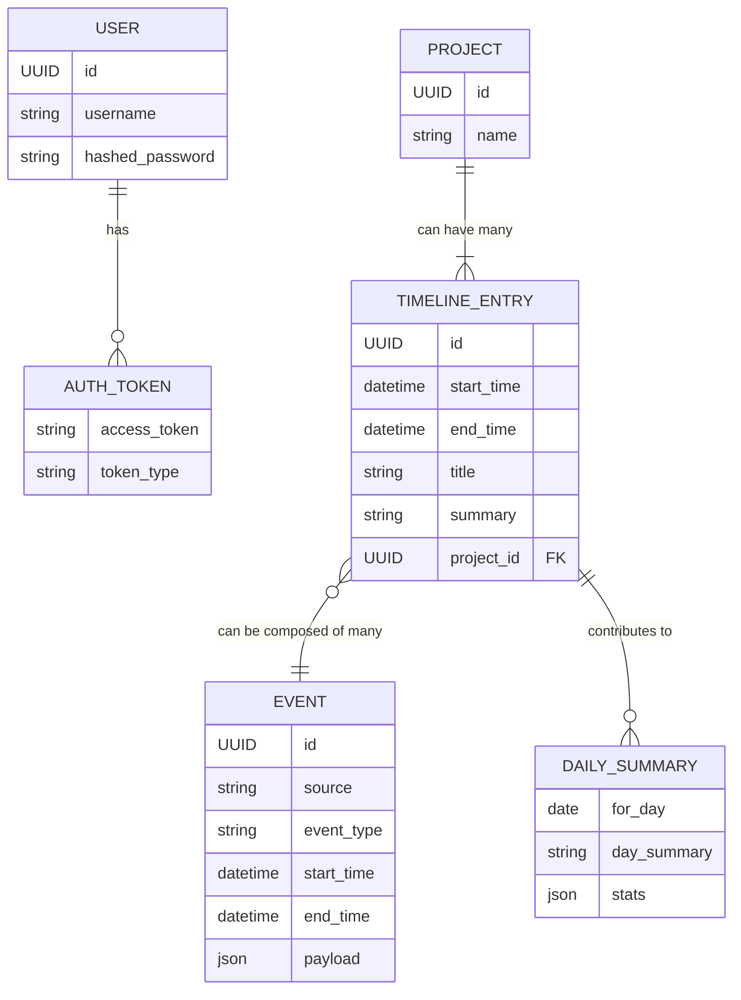

# API Design Plan: LifeLog "AMAZING" API

## 1. Introduction & Goals

The primary goal of this initiative is to design and document a new backend API for the LifeLog application. This API aims to be "AMAZING," offering "super good features" and "ease of use." The immediate focus is on creating a stable, well-defined REST API that the frontend can reliably build upon, featuring excellent interactive documentation (e.g., Swagger/OpenAPI).

### Definitions

*   **"AMAZING API"**:
    *   **Reliable & Stable**: Ensures predictable behavior through well-tested and robust implementation.
    *   **Well-Defined**: Adheres to clear contracts, consistent RESTful endpoint structures, and well-defined Pydantic data models.
    *   **Excellent Developer Experience**: Achieved primarily through comprehensive, auto-generated interactive documentation (OpenAPI/Swagger). This includes clear, consistent naming, and helpful error messages.
    *   **Secure**: Implements robust authentication (e.g., JWT) and authorization mechanisms to protect data.
    *   **Performant**: Designed for efficient data retrieval and processing, especially for common frontend queries.

*   **"Super Good Features"**:
    *   **Comprehensive Data Access**: Provides CRUD (Create, Read, Update, Delete) operations for core entities like `Projects`, `TimelineEntries`, and potentially `Events`.
    *   **Advanced Querying & Filtering**: Supports flexible querying by date ranges, project associations, event types, and other relevant criteria.
    *   **Data Summarization & Aggregation**: Offers endpoints for generating daily summaries, statistics, and insights.
    *   **Configuration Endpoints**: If applicable, allows management of user-specific or system-wide settings.

*   **"Ease of Use" (Developer Experience Focus)**:
    *   **Interactive OpenAPI/Swagger Documentation**: Automatically generated, providing a "single source of truth" for API contracts and allowing easy endpoint testing.
    *   **Consistent Naming Conventions**: Standardized and predictable names for endpoints, query parameters, and JSON fields.
    *   **Standard HTTP Practices**: Correct and consistent use of HTTP methods, status codes, and headers.
    *   **Clear and Actionable Error Messages**: Responses that help developers quickly understand and resolve issues.
    *   **Logical Resource Grouping**: Endpoints organized intuitively around resources.

## 2. Technology Stack

*   **Language/Framework**: Python with **FastAPI**.
    *   **Reasoning**:
        *   High performance.
        *   Automatic data validation, serialization, and deserialization using Pydantic models.
        *   Automatic generation of interactive OpenAPI (Swagger UI) and ReDoc documentation, directly addressing a key user requirement.
        *   Modern Python features (async support).
        *   Large and active community.
*   **Database**: Existing DuckDB setup (as per [`backend/app/data/schema.sql`](backend/app/data/schema.sql:1)). FastAPI can integrate with any database via appropriate ORMs or query builders (e.g., SQLAlchemy, databases library).

## 3. API Design Principles

*   **RESTful Architecture**: Design API around resources, using standard HTTP methods for operations.
*   **Statelessness**: Each request from a client to the server must contain all the information needed to understand the request. The server should not store any client context between requests. Session state, if any, should be managed client-side or via tokens.
*   **Resource-Oriented Design**:
    *   Resources identified by URIs (e.g., `/projects`, `/projects/{project_id}`).
    *   Use plural nouns for resource collections.
*   **Standard HTTP Methods**:
    *   `GET`: Retrieve resources.
    *   `POST`: Create new resources.
    *   `PUT`: Update/replace existing resources entirely.
    *   `PATCH`: Partially update existing resources.
    *   `DELETE`: Remove resources.
*   **Standard HTTP Status Codes**: Use appropriate status codes to indicate request outcomes (e.g., `200 OK`, `201 Created`, `204 No Content`, `400 Bad Request`, `401 Unauthorized`, `403 Forbidden`, `404 Not Found`, `500 Internal Server Error`).
*   **JSON for Data Exchange**: API will accept JSON-formatted request bodies and send JSON-formatted responses.

## 4. Base URL and Versioning

*   **Base URL**: All API endpoints will be prefixed with `/api`.
    *   Example: `http://localhost:8000/api/...`
*   **Versioning Strategy**: URI Path-based versioning.
    *   Example: `/api/v1/projects`, `/api/v1/timeline`
    *   **Reasoning**: Explicit, clear, and widely understood. Allows for future iterations of the API without breaking existing clients. The initial version will be `v1`.

## 5. Authentication and Authorization

*   **Authentication Mechanism**: **JWT (JSON Web Tokens)**.
    *   Clients will authenticate to obtain a JWT.
    *   This token will be sent in the `Authorization` header with the `Bearer` scheme for subsequent requests to protected endpoints.
    *   Endpoints:
        *   `POST /api/v1/auth/token`: Accepts user credentials (e.g., username/password, or API key if preferred for a single-user system), returns JWT.
        *   `POST /api/v1/auth/refresh`: Accepts a valid refresh token (if implementing refresh tokens) to issue a new access token.
*   **Token Contents**: JWT payload should include user identifier and expiration time (`exp`). May include roles or permissions for authorization.
*   **Security**:
    *   Use HTTPS for all communication.
    *   Set appropriate token expiration times (short-lived for access tokens, longer for refresh tokens if used).
    *   Store tokens securely on the client-side.
*   **Authorization**:
    *   Initially, assume a single-user context where a valid token grants access to all resources.
    *   If multi-tenancy or more granular permissions are needed in the future, Role-Based Access Control (RBAC) can be implemented. This would involve:
        *   Defining roles (e.g., `admin`, `user`).
        *   Assigning permissions to roles.
        *   Checking user's role/permissions within endpoint logic or via FastAPI dependencies.
    *   Protected endpoints will require a valid JWT. Public endpoints (e.g., health check, API documentation) will not.

*(Further sections like Data Models, Core Resources, Error Handling, etc., will be added next.)*
## 6. Data Models (Pydantic Schemas)

Pydantic models will be used to define clear data schemas for request and response bodies, ensuring validation and serialization. These models will largely correspond to the database schema ([`backend/app/data/schema.sql`](backend/app/data/schema.sql:1)) and frontend types ([`frontend/src/types.ts`](frontend/src/types.ts:1)).

All `id` fields will be `UUID`. Timestamps (`start_time`, `end_time`, `created_at`, `updated_at`) will be `datetime` objects, serialized to ISO 8601 strings.

### Base Models
```python
from pydantic import BaseModel, Field
from typing import Optional, List, Dict
from uuid import UUID
from datetime import datetime

class ProjectBase(BaseModel):
    name: str = Field(..., example="LifeLog Development")

class ProjectCreate(ProjectBase):
    pass

class ProjectUpdate(ProjectBase):
    name: Optional[str] = Field(None, example="LifeLog Core Development")

class Project(ProjectBase):
    id: UUID
    # embedding: Optional[List[float]] # Handled internally, not directly exposed via basic CRUD

    class Config:
        orm_mode = True

# --- Timeline Entry ---
class TimelineEntryBase(BaseModel):
    start_time: datetime
    end_time: datetime
    title: str = Field(..., example="Working on API design document")
    summary: Optional[str] = Field(None, example="Detailed planning for v1 endpoints and data models.")
    project_id: Optional[UUID] = Field(None)

class TimelineEntryCreate(TimelineEntryBase):
    # Potentially link to source event_ids during creation
    source_event_ids: Optional[List[UUID]] = Field(None, example=[UUID("..."), UUID("...")])

class TimelineEntryUpdate(BaseModel):
    start_time: Optional[datetime] = None
    end_time: Optional[datetime] = None
    title: Optional[str] = Field(None, example="Refining API design")
    summary: Optional[str] = Field(None, example="Added error handling and pagination details.")
    project_id: Optional[UUID] = Field(None)
    # Allow updating source_event_ids if necessary, though this might be complex
    source_event_ids: Optional[List[UUID]] = Field(None)


class TimelineEntry(TimelineEntryBase):
    id: UUID
    local_day: datetime # Date object, but serialized as string
    project: Optional[Project] = None # Populated if project_id exists
    # source_events: List[Event] # If we decide to expose linked raw events

    class Config:
        orm_mode = True

# --- Event (Raw Data) ---
# Events are largely immutable once ingested by backend processes.
# API might allow reading them, or perhaps manual creation of certain types.
class EventBase(BaseModel):
    source: str = Field(..., example="activitywatch_aw-watcher-window")
    event_type: str # Corresponds to event_kind ENUM ('digital_activity', 'health_metric', etc.)
    start_time: datetime
    end_time: Optional[datetime] = None
    # payload_hash: str # Internal, not usually exposed
    # specific data like digital_activity_data would be nested or part of a union type
    payload: Dict # Generic payload for now, can be a Pydantic union for specific event_types

class Event(EventBase):
    id: UUID
    local_day: datetime # Date object

    class Config:
        orm_mode = True

# --- Daily Summary (similar to frontend/src/types.ts DailySummary) ---
class DailySummaryStats(BaseModel):
    total_active_time_min: int
    focus_time_min: int
    number_blocks: int
    top_project: Optional[str] = None
    top_activity: Optional[str] = None

class DailySummary(BaseModel):
    day_summary: str # LLM generated summary
    stats: DailySummaryStats
    version: int # Version of the summary generation logic

# --- User (for Auth) ---
class UserBase(BaseModel):
    username: str

class UserCreate(UserBase):
    password: str

class User(UserBase):
    id: UUID
    hashed_password: str # Not directly exposed

    class Config:
        orm_mode = True

# --- Auth Tokens ---
class Token(BaseModel):
    access_token: str
    token_type: str

class TokenData(BaseModel):
    username: Optional[str] = None

```

## 7. Core Resources and Endpoints

All endpoints are prefixed with `/api/v1`. All endpoints requiring authentication will expect a JWT Bearer token.

### Authentication

*   **`POST /auth/token`**
    *   **Description**: Authenticate user and receive JWT.
    *   **Request Body**: `application/x-www-form-urlencoded` with `username` and `password`. (FastAPI's `OAuth2PasswordRequestForm`)
    *   **Response (200 OK)**: `Token`
    *   **Response (400 Bad Request)**: Invalid credentials.

### Projects

Resource: Represents a project that timeline entries can be associated with. Based on `projects` table.

*   **`POST /projects`**
    *   **Description**: Create a new project.
    *   **Request Body**: `ProjectCreate`
    *   **Response (201 Created)**: `Project`
    *   **Response (400 Bad Request)**: Invalid input.
    *   **Response (409 Conflict)**: Project with the same name already exists.
*   **`GET /projects`**
    *   **Description**: List all projects. Supports pagination.
    *   **Query Parameters**: `skip: int = 0`, `limit: int = 100`
    *   **Response (200 OK)**: `List[Project]`
*   **`GET /projects/{project_id}`**
    *   **Description**: Get a specific project by ID.
    *   **Response (200 OK)**: `Project`
    *   **Response (404 Not Found)**: Project not found.
*   **`PUT /projects/{project_id}`**
    *   **Description**: Update an existing project.
    *   **Request Body**: `ProjectUpdate` (or `ProjectCreate` if full replacement)
    *   **Response (200 OK)**: `Project`
    *   **Response (400 Bad Request)**: Invalid input.
    *   **Response (404 Not Found)**: Project not found.
*   **`DELETE /projects/{project_id}`**
    *   **Description**: Delete a project. Consider implications for timeline entries (e.g., disassociate or prevent deletion if linked).
    *   **Response (204 No Content)**
    *   **Response (404 Not Found)**: Project not found.
    *   **Response (409 Conflict)**: Project cannot be deleted (e.g., due to active associations).

### Timeline Entries

Resource: Represents processed and summarized blocks of time. Based on `timeline_entries` table.

*   **`POST /timeline`**
    *   **Description**: Create a new timeline entry (e.g., manual entry).
    *   **Request Body**: `TimelineEntryCreate`
    *   **Response (201 Created)**: `TimelineEntry`
    *   **Response (400 Bad Request)**: Invalid input.
*   **`GET /timeline`**
    *   **Description**: List timeline entries. Supports filtering by date range, project, etc. Supports pagination.
    *   **Query Parameters**:
        *   `start_date: Optional[date]` (YYYY-MM-DD)
        *   `end_date: Optional[date]` (YYYY-MM-DD)
        *   `project_id: Optional[UUID]`
        *   `skip: int = 0`, `limit: int = 20`
        *   `sort_by: str = "start_time"`, `order: str = "desc"`
    *   **Response (200 OK)**: `List[TimelineEntry]` (potentially a paginated response object)
*   **`GET /timeline/{entry_id}`**
    *   **Description**: Get a specific timeline entry by ID.
    *   **Response (200 OK)**: `TimelineEntry`
    *   **Response (404 Not Found)**: Entry not found.
*   **`PUT /timeline/{entry_id}`**
    *   **Description**: Update an existing timeline entry.
    *   **Request Body**: `TimelineEntryUpdate`
    *   **Response (200 OK)**: `TimelineEntry`
    *   **Response (400 Bad Request)**: Invalid input.
    *   **Response (404 Not Found)**: Entry not found.
*   **`DELETE /timeline/{entry_id}`**
    *   **Description**: Delete a timeline entry.
    *   **Response (204 No Content)**
    *   **Response (404 Not Found)**: Entry not found.

### Events (Raw Data)
### Entity Relationship Diagram (Conceptual)



Resource: Represents raw ingested data points. Based on `events` table and associated data tables like `digital_activity_data`. These are generally immutable post-ingestion. API access might be primarily read-only or for specific diagnostic/manual addition purposes.

*   **`GET /events`**
    *   **Description**: List raw events. Supports filtering by date range, source, event type. Supports pagination.
    *   **Query Parameters**:
        *   `start_time: Optional[datetime]` (ISO 8601)
        *   `end_time: Optional[datetime]` (ISO 8601)
        *   `source: Optional[str]`
        *   `event_type: Optional[str]`
        *   `skip: int = 0`, `limit: int = 100`
    *   **Response (200 OK)**: `List[Event]`
*   **`GET /events/{event_id}`**
    *   **Description**: Get a specific raw event by ID.
    *   **Response (200 OK)**: `Event`
    *   **Response (404 Not Found)**: Event not found.
    *   *(Note: POST, PUT, DELETE for events might be restricted or not exposed if events are meant to be immutable after system ingestion.)*

### Daily Data / Summaries

This mirrors the current frontend need for `fetchDayData`.

*   **`GET /day/{date_string}`** (e.g., `/day/2023-10-26`)
    *   **Description**: Get all timeline entries and a summary for a specific day (in local timezone).
    *   **Path Parameter**: `date_string` (YYYY-MM-DD format).
    *   **Response (200 OK)**:
        ```json
        {
          "entries": "List[TimelineEntry]",
          "summary": "DailySummary"
        }
        ```
        (Similar to `DayDataResponse` in [`frontend/src/api/client.ts`](frontend/src/api/client.ts:5))
    *   **Response (400 Bad Request)**: Invalid date format.
    *   **Response (404 Not Found)**: No data for the given date.

### System Operations (Optional)

*   **`POST /system/process-now`**
    *   **Description**: Trigger on-demand processing of pending events (similar to current CLI `process-now`).
    *   **Response (202 Accepted)**: Processing started.
    *   **Response (409 Conflict)**: Processing already in progress.
*   **`GET /system/status`**
    *   **Description**: Get the current status of the system (e.g., daemon running, last processing time).
    *   **Response (200 OK)**: `Dict` (e.g., `{"processing_status": "idle", "last_processed_event_time": "..."}`)

### Search

*   **`GET /search`**
    *   **Description**: Perform a global search across timeline entries, (potentially events, projects).
    *   **Query Parameters**:
        *   `q: str` (search query)
        *   `date_from: Optional[date]`
        *   `date_to: Optional[date]`
        *   `project_ids: Optional[List[UUID]]`
        *   `limit: int = 25`
    *   **Response (200 OK)**: `Dict` (e.g., `{"timeline_results": List[TimelineEntry], "project_results": List[Project]}`)

*(Continue with Error Handling, Rate Limiting, Documentation, Future Considerations)*
## 8. Error Handling

FastAPI provides default error handling, but we can customize it for consistency.

*   **Standard Error Response Schema**:
    ```python
    from pydantic import BaseModel
    from typing import Optional, List, Any

    class ErrorDetail(BaseModel):
        loc: Optional[List[str]] = None # Location of the error (e.g., field name)
        msg: str                    # Error message
        type: str                   # Error type (e.g., 'value_error.missing')

    class HTTPError(BaseModel):
        detail: Any # Can be a string or List[ErrorDetail] for validation errors

    # Example for a 404 Not Found
    # { "detail": "Resource not found" }

    # Example for a 422 Unprocessable Entity (Validation Error)
    # {
    #   "detail": [
    #     {
    #       "loc": ["body", "project_id"],
    #       "msg": "value is not a valid uuid",
    #       "type": "type_error.uuid"
    #     }
    #   ]
    # }
    ```
*   **Common HTTP Status Codes to Use**:
    *   `200 OK`: Standard response for successful GET.
    *   `201 Created`: Resource successfully created (POST). Response should include a `Location` header with URI of new resource.
    *   `202 Accepted`: Request accepted for processing, but processing not complete (e.g., for async tasks).
    *   `204 No Content`: Successful request with no body to return (e.g., DELETE).
    *   `400 Bad Request`: General client-side error (e.g., malformed request syntax, invalid parameters not caught by validation).
    *   `401 Unauthorized`: Client not authenticated or token invalid/expired.
    *   `403 Forbidden`: Client authenticated but does not have permission to access the resource.
    *   `404 Not Found`: Requested resource does not exist.
    *   `409 Conflict`: Request conflicts with current state of the server (e.g., duplicate resource creation).
    *   `422 Unprocessable Entity`: Request well-formed but contains semantic errors (FastAPI uses this for validation errors).
    *   `500 Internal Server Error`: Unexpected server-side error. Avoid exposing detailed stack traces.
    *   `503 Service Unavailable`: Server temporarily unable to handle request (e.g., maintenance, overload).

## 9. Rate Limiting

To protect the API from abuse and ensure availability:

*   **Strategy**: Implement token bucket or fixed window algorithm.
*   **Implementation**:
    *   Use a middleware (e.g., `slowapi` for FastAPI).
    *   Apply rate limits per user/IP and potentially per endpoint.
    *   Example limits: 100 requests/minute for general endpoints, stricter for auth endpoints.
*   **Response**: Return `429 Too Many Requests` status code when limit exceeded. Include `Retry-After` header.

## 10. Documentation

*   **Primary Tool**: FastAPI's automatic OpenAPI generation.
    *   **Swagger UI**: Available at `/docs` (by default).
    *   **ReDoc**: Available at `/redoc` (by default).
*   **Guidelines**:
    *   Write clear, concise `summary` and `description` fields for all Pydantic models and FastAPI path operations (endpoints).
    *   Use `example` or `examples` in Pydantic models and path operation parameters to illustrate expected data.
    *   Clearly document authentication requirements for each endpoint.
    *   Keep documentation up-to-date as the API evolves.
    *   The generated OpenAPI schema (`/openapi.json`) serves as the machine-readable contract.

## 11. Future Considerations

Items to consider for future API versions or enhancements:

*   **Pagination**:
    *   Implement consistent pagination for all list endpoints.
    *   Options:
        *   Offset/Limit (e.g., `skip`/`limit` as shown).
        *   Cursor-based pagination for large datasets or real-time feeds.
    *   Include pagination metadata in responses (e.g., `total_items`, `total_pages`, `next_page_link`, `prev_page_link`).
*   **Sorting**:
    *   Allow sorting on relevant fields for list endpoints (e.g., `sort_by=start_time&order=desc`).
*   **Advanced Filtering**:
    *   Beyond simple query parameters, consider a more expressive filtering language if needed.
*   **WebSockets**:
    *   For real-time updates (e.g., live timeline updates, notifications).
*   **Caching**:
    *   Implement caching strategies (e.g., ETag headers, Redis/Memcached) for frequently accessed, non-volatile data to improve performance and reduce database load.
*   **Asynchronous Tasks**:
    *   For long-running operations (e.g., large data processing, report generation), use background tasks (e.g., Celery with FastAPI) and provide endpoints to check task status.
*   **API Keys**:
    *   For third-party integrations or headless services, an API key system might be more appropriate than user/password-based JWTs.
*   **HATEOAS (Hypermedia as the Engine of Application State)**:
    *   Include links in responses to related resources and possible actions, making the API more discoverable.
*   **GraphQL Endpoint**:
    *   If frontend requirements become very complex with data fetching, consider adding a parallel GraphQL endpoint.