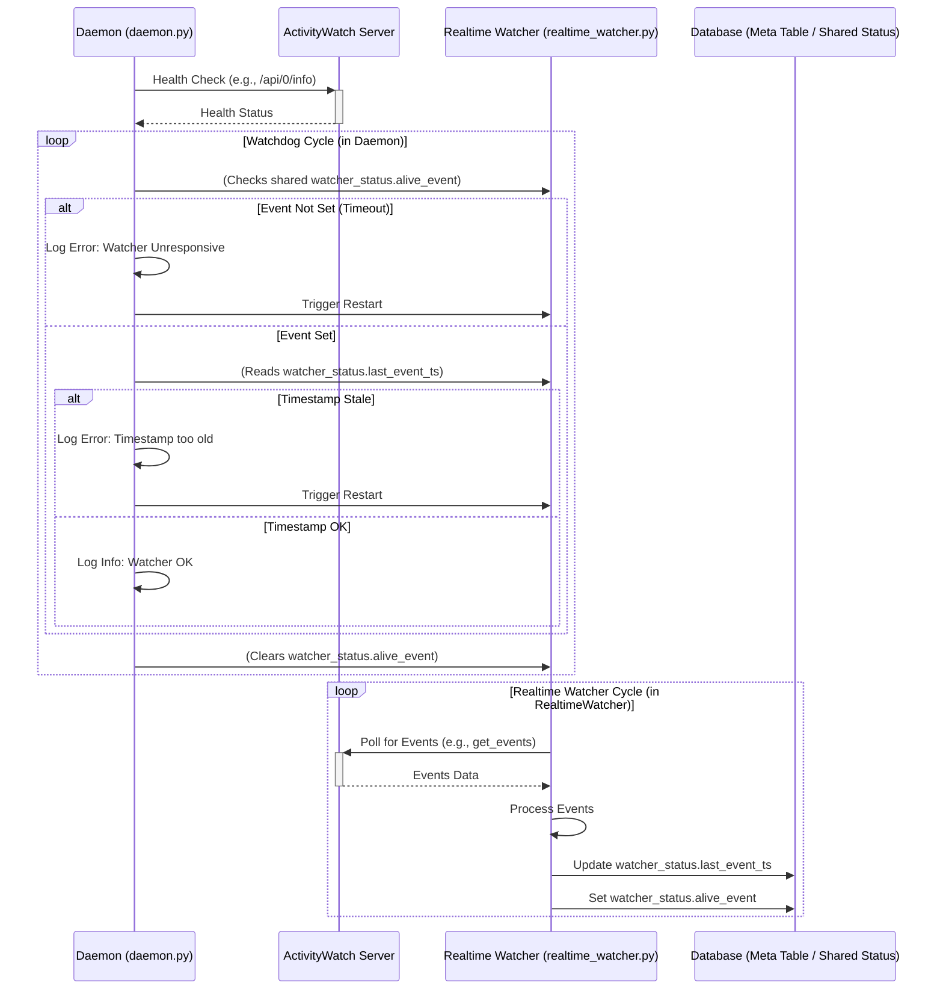

# Design: Enhanced Reliability for LifeLog Data Ingestion

## 1. Introduction

This document outlines the design for improving the reliability of data ingestion in LifeLog. It focuses on two main areas:
1.  Implementing health checks for the ActivityWatch (AW) server.
2.  Enhancing the monitoring of the `realtime_watcher.py` component.

The design aims to integrate these improvements into the existing application structure, primarily affecting [`daemon.py`](backend/app/daemon/daemon.py) and [`realtime_watcher.py`](backend/app/daemon/realtime_watcher.py).

## 2. ActivityWatch Server Health Check

This mechanism will allow the LifeLog daemon to periodically verify the status of the ActivityWatch server.

### 2.1. Proposed Mechanism

A new scheduled job will be added to the `APScheduler` within [`daemon.py`](backend/app/daemon/daemon.py). This job will be responsible for pinging the ActivityWatch server.

**Implementation Sketch (in `daemon.py`):**
```python
from aw_client import ActivityWatchClient # Ensure this client is suitable or use requests
# from backend.app.core.db import set_meta # If status needs to be stored in DB

# Define this new function in daemon.py
def aw_server_health_check_job(db_connection=None): # db_connection if writing status to DB
    log.info("Running ActivityWatch server health check...")
    # It's good practice to use a specific client name for this task
    aw_client = ActivityWatchClient(client_name="lifelog_daemon_aw_health_check", testing=False)
    aw_api_endpoint = "/api/0/info" # Standard AW info endpoint

    try:
        # The aw_client library might have a direct method like client.get_info()
        # or a generic method client.request("GET", aw_api_endpoint).
        # If not, 'requests' library could be a fallback.
        # For this design, we assume aw_client can perform this.
        info = aw_client.get_info() # Placeholder for actual method
        # Alternatively: response = aw_client.get(aw_api_endpoint)
        
        if info: # Or check response.status_code == 200
            log.info(f"ActivityWatch server is healthy. Version: {info.get('version', 'N/A')}")
            # Optionally, update a status in the database:
            # if db_connection:
            #     set_meta(db_connection, 'aw_server_last_healthy_ping', datetime.now(timezone.utc).isoformat())
        else:
            log.warning(f"ActivityWatch server health check returned unexpected response: {info}")
            # Handle as an error or degraded state
            # if db_connection:
            #     set_meta(db_connection, 'aw_server_status', 'degraded_response')

    except Exception as e:
        log.error(f"ActivityWatch server health check failed: {e}", exc_info=True)
        # Optionally, update a status in the database:
        # if db_connection:
        #     set_meta(db_connection, 'aw_server_status', 'unhealthy')
        # Further alerting logic can be built on this log or DB state.

# In main() function of daemon.py, add to scheduler:
scheduler.add_job(
    aw_server_health_check_job, # Or run_transactional_job if DB writes are involved
    trigger=IntervalTrigger(minutes=15), # Configurable frequency
    # args=[aw_server_health_check_job] if using run_transactional_job
    id="aw_server_health_check",
    max_instances=1,
    coalesce=True,
    misfire_grace_time=300, # 5-minute grace
)
```

### 2.2. API Endpoint

The primary endpoint to target is `/api/0/info` on the ActivityWatch server. This is a standard AW endpoint that provides basic server information and confirms its operational status.

### 2.3. Frequency

A check frequency of **every 15 minutes** is proposed. This is frequent enough to detect prolonged outages without excessively loading the AW server. This should be configurable via `settings.py`.

### 2.4. Failure Handling & Logging

*   **Successful Check**: Log an informational message. Optionally, a timestamp of the last successful check could be stored (e.g., using `set_meta` in the database).
*   **Unresponsive Server / Errors**:
    *   Log an error message with details of the failure (e.g., connection error, timeout, non-200 status code). Use `exc_info=True` for exceptions.
    *   The log should be clear and structured, e.g., `ActivityWatch server unhealthy: [Reason]`.
    *   For future alerting systems, this error logging is the primary flag. A specific status (e.g., 'AW_SERVER_UNHEALTHY') could also be written to the database via `set_meta` if more persistent state tracking is desired.

### 2.5. Affected Files

*   [`backend/app/daemon/daemon.py`](backend/app/daemon/daemon.py): For the new scheduler job, health check logic, and logging.
*   [`backend/app/core/settings.py`](backend/app/core/settings.py) (Optional): To make the health check frequency configurable.
*   [`backend/app/core/db.py`](backend/app/core/db.py) (Optional): If `set_meta`/`get_meta` is used for storing health status.

## 3. Enhanced Real-Time Watcher Monitoring

This involves augmenting the existing `watchdog` in [`daemon.py`](backend/app/daemon/daemon.py) to monitor not just the liveness of `realtime_watcher.py` but also the freshness of the data it processes.

### 3.1. Exposing "Last AW Event Timestamp Seen"

The `realtime_watcher.py` already tracks `last_event_timestamp` ([`realtime_watcher.py:83`](backend/app/daemon/realtime_watcher.py:83)). This needs to be communicated to the `watchdog` in `daemon.py`.

**Proposed Mechanism: Shared Status Object**

1.  In [`daemon.py`](backend/app/daemon/daemon.py), define a shared dictionary or a simple class instance to hold the watcher's status. This object will contain:
    *   The `threading.Event()` currently used as `watcher_alive`.
    *   A field for `last_aw_event_timestamp`.
    *   A `threading.Lock()` to synchronize access to the timestamp.

    ```python
    # In daemon.py, near global variables
    watcher_status = {
        'alive_event': threading.Event(),
        'last_event_ts': None, # Stores the actual datetime object
        'lock': threading.Lock()
    }
    ```

2.  Pass this `watcher_status` object to the `realtime_watcher_main` thread when it's started in [`daemon.py`](backend/app/daemon/daemon.py:183) instead of just the event.

    ```python
    # In daemon.py, when starting _realtime_watcher_thread
    _realtime_watcher_thread = threading.Thread(
        target=realtime_watcher_main,
        args=[watcher_status], # Pass the whole status object
        name="RealtimeWatcher",
        daemon=True
    )
    # Also for restart_watcher()
    # args=[watcher_status]
    ```

3.  In [`realtime_watcher.py`](backend/app/daemon/realtime_watcher.py), modify `main` to accept this object. Update the timestamp and set the event within this object.

    ```python
    # In realtime_watcher.py
    # def main(watcher_status: dict): # Accept the shared status object
    # ...
    # Inside the while True loop, after last_event_timestamp is updated
    # (e.g., around line 124, or after events are processed/polled)
    
    # Example: after successful poll or event processing
    # current_last_event_timestamp = last_event_timestamp # This is already tracked
    
    with watcher_status['lock']:
        watcher_status['last_event_ts'] = last_event_timestamp # last_event_timestamp is updated in the loop
    if watcher_status.get('alive_event'): # Check if event exists for robustness
         watcher_status['alive_event'].set()
    log.debug(f"Updated watcher status: last_event_ts={last_event_timestamp.isoformat()}")
    ```
    This should happen regularly, even if no new events are found, to signal liveness and update the timestamp (which would be the time of the poll if no new events). The current `last_event_timestamp` ([`realtime_watcher.py:83`](backend/app/daemon/realtime_watcher.py:83)) is updated with `event.timestamp` or `datetime.now(timezone.utc)` if initialized. It should reflect the timestamp of the latest event *seen by ActivityWatch* or the last poll time.

### 3.2. Integrating with Watchdog

The `watchdog` function in [`daemon.py`](backend/app/daemon/daemon.py:115) will be modified:

1.  It will wait on `watcher_status['alive_event']`.
2.  If the event is set (watcher is responsive):
    *   Acquire `watcher_status['lock']`.
    *   Read `watcher_status['last_event_ts']`.
    *   Release the lock.
    *   Compare this timestamp against `datetime.now(timezone.utc)`. If it's older than a configured threshold (N minutes), log an error and trigger `restart_watcher()`.
3.  Clear `watcher_status['alive_event']` for the next cycle.

**Implementation Sketch (in `daemon.py` `watchdog` function):**
```python
# In daemon.py - watchdog()
# (watcher_status is accessible as it's a global in daemon.py)
# from backend.app.core.settings import settings # For the threshold

log.info("Real-time watcher watchdog started.")
WATCHER_TIMESTAMP_THRESHOLD_MINUTES = settings.WATCHER_TIMESTAMP_THRESHOLD_MINUTES # e.g., 5 or 10 minutes

while True:
    if not watcher_status['alive_event'].wait(timeout=120): # Existing timeout
        log.error("Real-time watcher heartbeat (event) NOT received. Restarting watcher...")
        restart_watcher()
    else:
        # Event received, watcher is responsive. Now check timestamp freshness.
        with watcher_status['lock']:
            last_ts = watcher_status['last_event_ts']
        
        if last_ts:
            if datetime.now(timezone.utc) - last_ts > timedelta(minutes=WATCHER_TIMESTAMP_THRESHOLD_MINUTES):
                log.error(
                    f"Real-time watcher's last event/poll timestamp ({last_ts.isoformat()}) is older than "
                    f"{WATCHER_TIMESTAMP_THRESHOLD_MINUTES} minutes. Restarting watcher..."
                )
                restart_watcher()
            else:
                log.info(f"Real-time watcher heartbeat received. Last event/poll timestamp {last_ts.isoformat()} is recent.")
        else:
            # This case might happen on initial startup before the watcher has processed any event.
            # Could be a warning or info, depending on how soon a timestamp is expected.
            log.warning("Real-time watcher's last event/poll timestamp not yet available.")
            
    # Clear the event for the next cycle, regardless of the timestamp check outcome (if event was set)
    watcher_status['alive_event'].clear()
    # Add a small sleep to prevent tight looping if clear() happens too fast before next wait()
    time.sleep(1) # Or make the watcher_alive.wait timeout the main delay
```

### 3.3. Threshold (N minutes)

A reasonable threshold `N` for alerting if the "last AW event timestamp seen" is too old would be **5-10 minutes**. This should be longer than the `POLLING_INTERVAL_SECONDS` ([`realtime_watcher.py:27`](backend/app/daemon/realtime_watcher.py:27) - currently 10s) plus some buffer for processing, but short enough to detect genuine stalls. This threshold should be configurable in `settings.py` (e.g., `WATCHER_TIMESTAMP_THRESHOLD_MINUTES`).

### 3.4. Alerting & Logging

*   If the timestamp is older than `N` minutes:
    *   Log an error: `Real-time watcher's last event timestamp is too old: [timestamp]. Restarting.`
    *   Trigger the existing `restart_watcher()` mechanism.
*   The existing `watcher_alive` event timeout (currently 120 seconds) remains the first check for basic responsiveness.

### 3.5. Affected Files

*   [`backend/app/daemon/daemon.py`](backend/app/daemon/daemon.py): For modifying the `watcher_status` structure, `watchdog` logic, `_realtime_watcher_thread` instantiation, and `restart_watcher` calls.
*   [`backend/app/daemon/realtime_watcher.py`](backend/app/daemon/realtime_watcher.py): To accept the `watcher_status` object and update the timestamp and event within it.
*   [`backend/app/core/settings.py`](backend/app/core/settings.py): To add `WATCHER_TIMESTAMP_THRESHOLD_MINUTES`.

## 4. OS-Level Health Check (Guidance)

While direct implementation is out of scope for the Python application, users can implement OS-level health checks to monitor and restart the ActivityWatch server process itself.

### 4.1. Linux (systemd)

*   **Service Unit File**: If AW server is run as a `systemd` service, its unit file can be configured for automatic restarts and watchdog support.
*   **`Restart=`**: Use `Restart=on-failure` or `Restart=always` in the `[Service]` section to automatically restart the AW server if it crashes.
*   **Watchdog**:
    *   `WatchdogSec=`: Configure in the service unit to enable systemd's watchdog. The AW server would need to periodically signal `systemd` (e.g., via `sd_notify()`) that it's alive. If it fails to signal, `systemd` will restart it. This requires the AW server to have integrated `sd_notify` support.
    *   If AW server doesn't support `sd_notify`, a simpler health check can be done by `systemd` using `ExecStartPre=` or a custom script with `Type=notify` and `NotifyAccess=all` along with a helper script that pings AW's API and signals systemd.

### 4.2. Windows (Task Scheduler / Services)

*   **Windows Services**: If AW server can run as a Windows Service, the service's recovery options can be configured (e.g., "Restart the service" on first, second, and subsequent failures).
*   **Task Scheduler**:
    *   A scheduled task can run a script (e.g., PowerShell) that checks the AW server's health (e.g., pings an API endpoint).
    *   If the health check fails, the script can attempt to restart the AW server process.
    *   Task Scheduler can also be configured to restart a task if it fails or stops.

### 4.3. General Advice

*   **Idempotency**: Ensure AW server (and LifeLog ingestion) can handle restarts gracefully, without data duplication or corruption.
*   **Logging**: OS-level monitoring should also have robust logging to diagnose issues with the AW server process itself.
*   **Resource Limits**: Configure resource limits (CPU, memory) at the OS level if AW server tends to misbehave due to resource exhaustion.

## 5. Mermaid Diagram (Illustrative Interaction)



This design provides a more robust monitoring and health-checking framework for the LifeLog application's interaction with ActivityWatch.